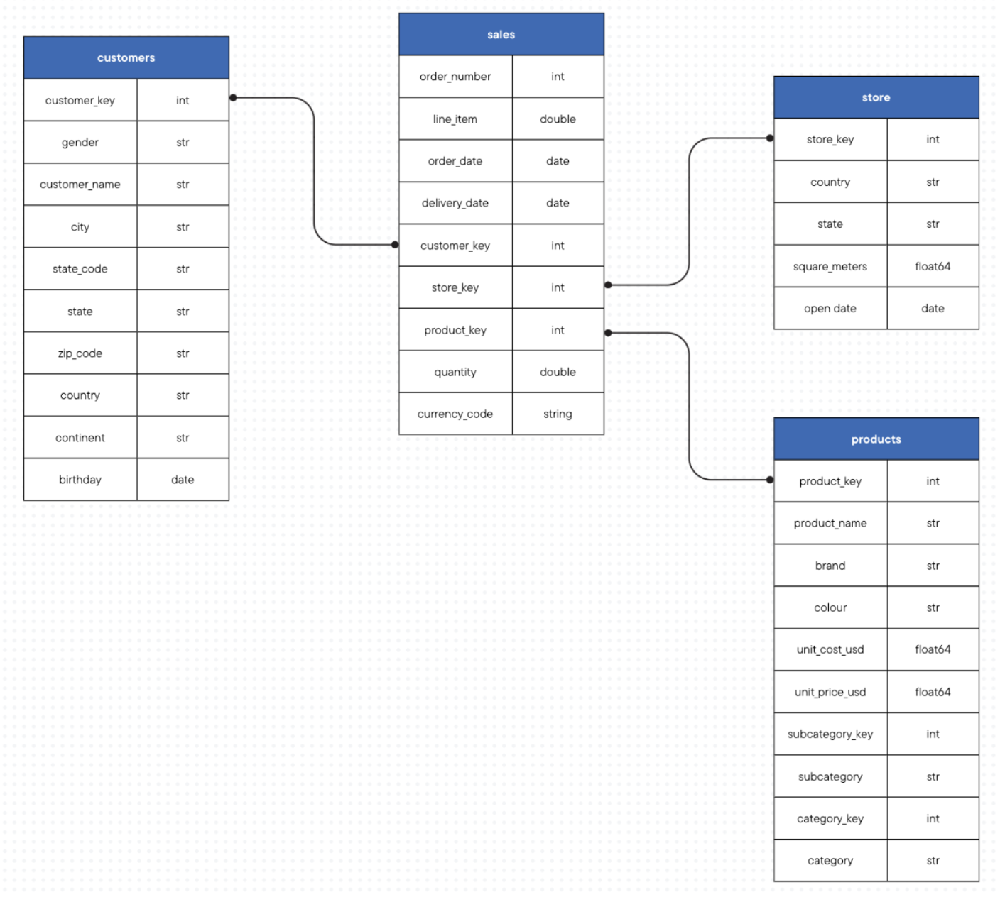
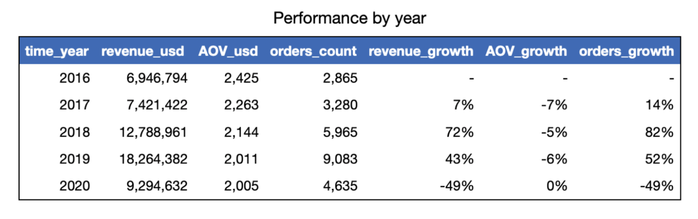
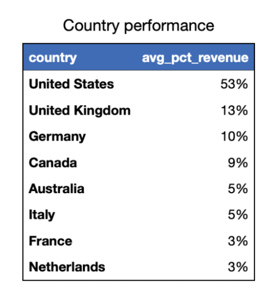
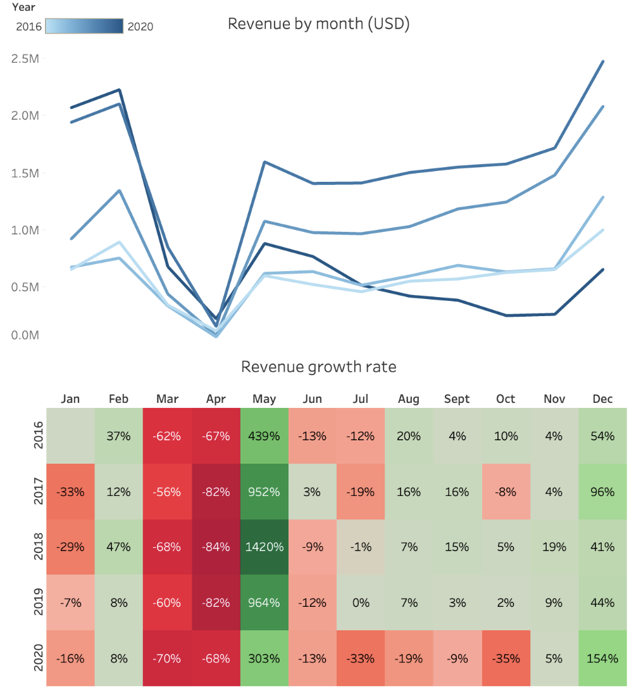
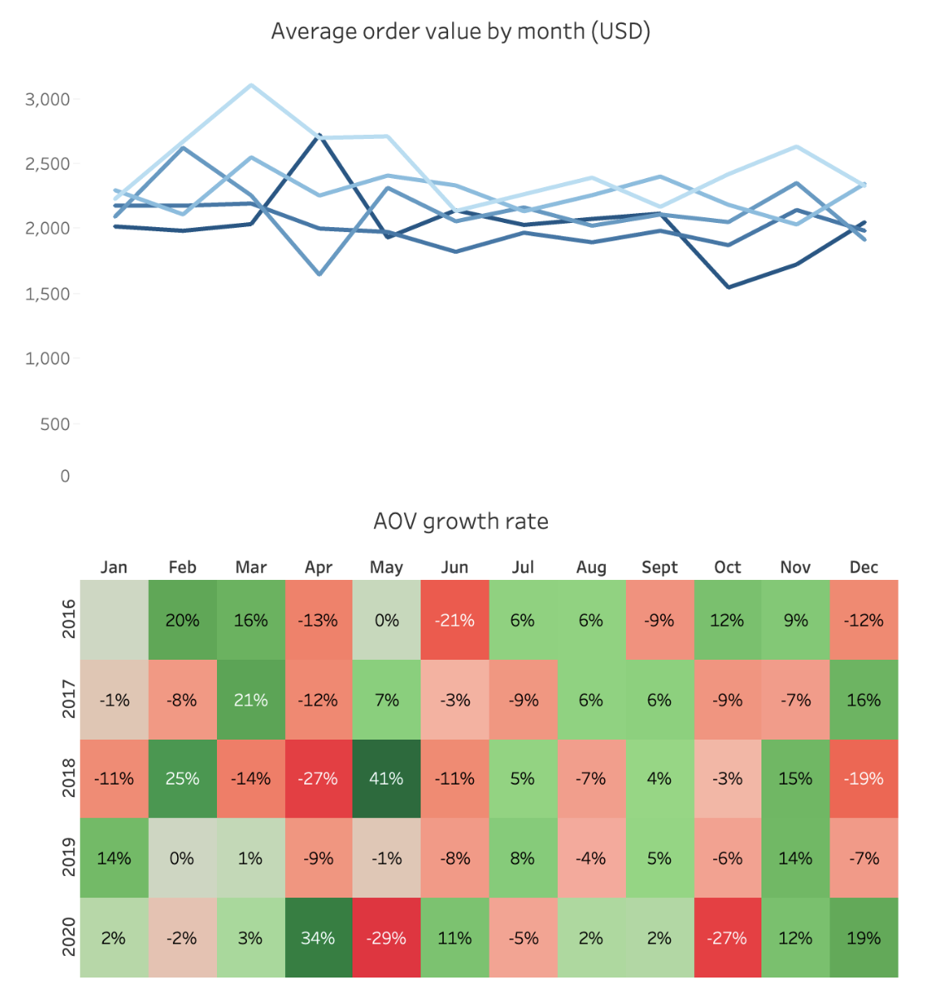
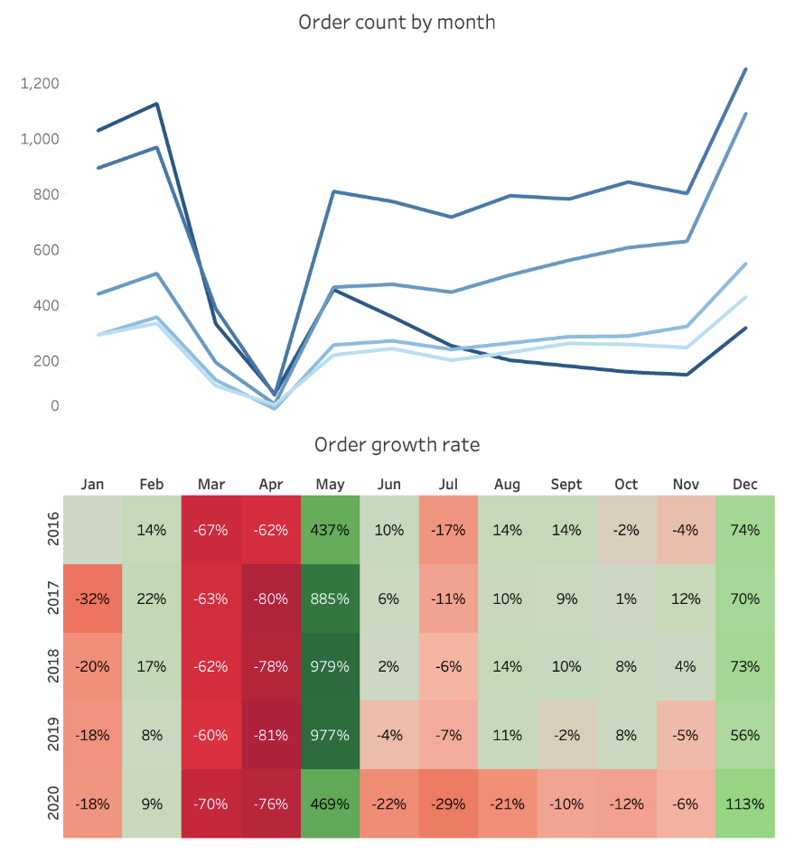
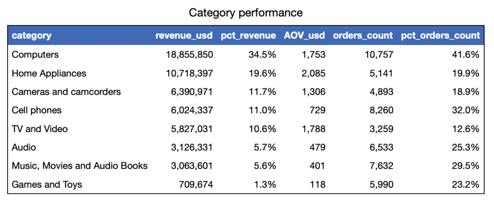
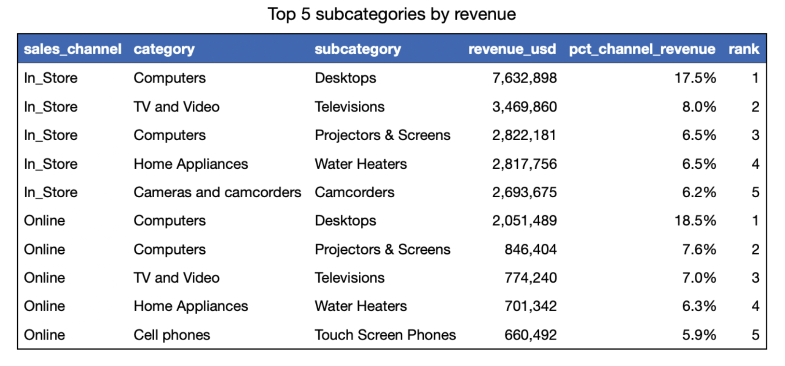
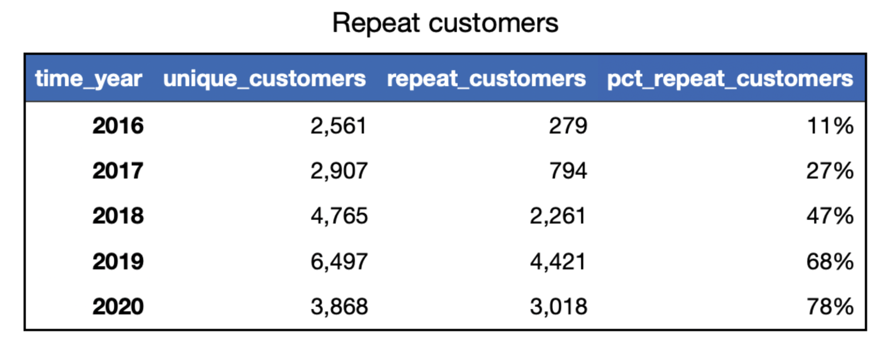
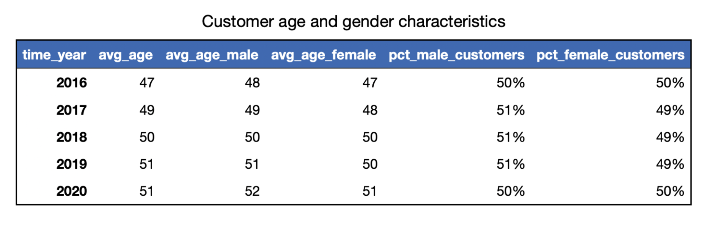

# Altar-Sales-Performance-Analysis
An exploration of Altar's sales performance between 2016 and 2020 and recommendations for growth

## Table of contents
- [Project background](#project-background)
- [Executive summary](#executive-summary)
- [Insights deep-dive](#insights-deep-dive)
  - [Sales trends and growth rates](#sales-trends-and-growth-rates)
  - [Product performance](#product-performance)
  - [Sales channel performance](#sales-channel-performance)
  - [Customer growth and loyalty](#customer-growth-and-loyalty)
  - [Customer demographics](#customer-demographics)
- [Recommendations](#recommendations)
- [Assumptions and caveats](#assumptions-and-caveats)
  
## Project background
Altar, a global electronics retailer founded in 2016, has established itself as a multi-brand distributor in the electronics market. This analysis supports the Head of Operations in identifying growth opportunities and optimising sales performance across channels and regions.

## Executive summary
Analysis of 620K sales records (2016-2021) reveals strong fundamentals despite COVID-19 disruption. As the 2021 data is incomplete, a decision was made to focus only on sales performance between 2016 and 2020.

The company maintains $11M average annual revenue with a healthy $2,160 average order value. North America and Europe contribute 95% of revenue, while online orders have grown from 17% to 23%. Notable is the exceptional customer loyalty growth from 11% to 78% repeat customers, though the aging customer base (average age 51) suggests a need for younger demographic acquisition. The Computers category leads revenue (34.5%), with opportunities in the fast-growing Games and Toys segment.

## Insights deep-dive
### Sales trends and growth rates
- Altar averages $11 million in annual revenue and 5,166 orders.
- Altar has a strong average order value (AOV) of $2,160, indicating successful premium market positioning. This is further explored in the product performance section.

- North America dominates with 61% of revenue, demonstrating market strength.
- Europe contributes 34%, making mature markets account for 95% of total revenue
- All regions achieved 70%+ revenue growth in 2018, followed by pre-pandemic slowdown in 2019.
- Heavy concentration in mature markets suggests opportunity for geographic expansion.

  

- Peak sales consistently occur in December, suggesting strong holiday season performance.
- On the other hand, April marks annual sales trough, presenting opportunity for targeted promotional strategies.
- There is a clear seasonal pattern, which should be leveraged to enable better inventory and marketing planning.

  <table>
    <tr>
      <td></td>
      <td></td>
      <td></td>
    </tr>
  </table>

### Product performance
- The Computers category leads revenue (34.5%) between 2016 and 2020. Desktop Computers contributed 17.7%, 10% higher than the second highest subcategory (Televisions). This strong computing focus provides stable revenue but may represent potential concentration risk.
- The Games and Toys category shows exceptional performance with highest average annual growth rates across revenue growth (51.2%), AOV growth (4.0%) and order growth rate (48.8%). The success of this category indicates potential for further expansion and investment.
- Despite ranking second in revenue, the Home Appliances category shows a concerning decline across revenue growth (-5.9%), AOV growth (-1.4%) and order growth rate (-3.7%). Negative trends across all metrics suggest need for category strategy revision.

### Sales channel performance
- Online order share grew from 17% in 2016 to 23% in 2020. Steady digital growth indicates successful e-commerce transformation and opportunity exists to accelerate online channel growth.
- Notably, desktop computers lead both sales channels (in-store: 17.5%;  online: 18.5%.
- Touch screen phones shows strong online performance, ranking number 5 in contribution to online revenue, while camcorders ranks number 5 for the in-store channel.
- Channel-specific preferences suggest opportunities for targeted merchandising strategies.

### Customer growth and loyalty
- Altar’s unique customers grew from 2,561 in 2016 and peaked at 6,497 in 2019. There is a 40% decline in 2020 due to the pandemic, but there is strong recovery potential based on pre-pandemic growth trajectory.
- There has been a remarkable growth in repeat customers from 11% in 2016 to 78% in 2020. High retention rates suggest effective customer satisfaction but potential overreliance on existing customers.
- However, both the number of unique customers and repeat customers dropped in 2020. The high proportion of repeat customers during market uncertainty signals strong loyalty among existing customer base and challenges in new customer acquisition during the pandemic.

### Customer demographics
- The average age of Altar customers increased from 47 years old in 2016 to 51 years old in 2020. The average age of male customers tends to lean 1 year higher than that of female customers. Aging customer base may suggest a need for younger customer acquisition strategies.
- Altar has maintained a stable customer gender distribution, floating around an even distribution of 50% - 51% male and 49% - 50% female. The balanced gender mix indicates broad demographic appeal.

## Recommendations
1. Maximising product portfolio
- Expand high-performing categories, e.g. increase Desktop Computer variations to maintain 17.7% revenue leadershipm and develop premium computer peripherals and accessories bundle offerings.
- Capitalise on 51.2% growth rate by expanding product selection in the Games and Toys category
- Address negative growth trends (-5.9% revenue, -1.4% AOV) in the Home Appliances category by initiating bundles with other categories to boost sales.
  
2. Customer growth and retention
- Develop strategies to rebound from 40% customer decline, e.g. launch referral programs targeting existing loyal customers.
- Create first-time buyer incentives and implement targeted marketing campaigns to attract younger demographics.
- Create personalised re-engagement campaigns for lapsed customers and implement post-purchase follow-up program.

3. Channel optimisation
- Build on online order share growth (17% to 23%) by enhancing website user experience and navigation, implementing AI-powered product recommendations, and developing seamless cross-device shopping experience.
- Strengthen in-store experience by optimising store layouts based on product performance, creating interactive product demonstration areas, and implementing click-and-collect service.
- Build and embed staff training on cross-selling and upselling techniques to increase overall revenue.

4. Geographic Expansion
- Maintain strong performance in core markets to maintain North American dominance (61% revenue) and strengthen European presence (34% revenue).
- Focus on expansion into new markets by developing localised marketing campaigns by identifying high-potential growth markets, developing market entry strategies, and creating localised partnerships.

5. Seasonal Optimisation
- Optimise and implement predictive inventory management based on clear seasonality patterns, e.g., leverage data to improve December holiday season inventory planning, develop early bird holiday promotions and create holiday-specific bundles.
- Establish an off-peak strategy to address persistent April sales trough, e.g., create off-season promotional calendar, develop seasonal product transitions, implement flash sales during slow periods.

## Assumptions and Caveats
1. Data timeline considerations
- Analysis focuses on 2016-2020 due to incomplete 2021 data. 2020 data may be anomalous due to pandemic effects.

2. Customer data limitations
- Age data assumes accurate customer self-reporting of birthdays.
- Gender data is currently limited to binary classification.
- Customer location is based on shipping address, which may not reflect actual residence.
- Repeat purchase analysis assumes consistent customer_key tracking.

3. Channel attribution
- Online vs in-store attribution is based on final purchase location.
- The data does not allow tracking cross-channel customer journey.

4. Product performance analysis
- The data assumes that product categorisation is consistent throughout analysis period.
- No change in product prices is recorded in the data.

5. Data quality considerations
- There is no data available on refund, and it is therefore assumed that transactions are complete post-order.
- Repeat customer is defined as customers who have placed ≥2 orders.
- There was no information on major loyalty program changes during the period.
